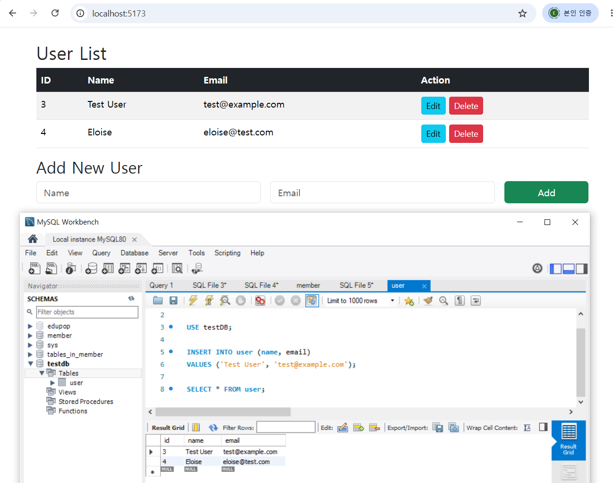
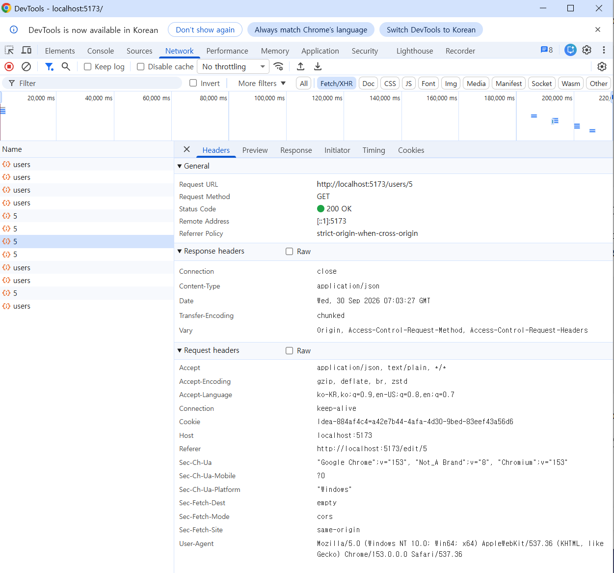

# Lab 01. React + Spring Boot + MySQL Integration

강사 제공 React / Spring Boot 예제를 로컬 MySQL 8.0 환경에 맞게 재구성한 통합 실습.  
React → Vite Proxy → Spring Boot → MyBatis → MySQL 흐름 구성 및 CRUD 동작 검증.

## Scope

| 구분 | 내용 |
|---|---|
| Provided | React + Vite frontend, Spring Boot + MyBatis backend, MariaDB 기준 datasource 설정, `testDB.sql` |
| My work | MySQL 8.0 적용, datasource 변경, credential 환경변수 분리, React–Spring Boot 연동, CRUD 동작 검증 |

강사 제공 코드는 baseline commit으로 분리.  
로컬 환경에 맞춘 설정 변경 및 연동 작업은 후속 commit으로 관리.

## Architecture

```text
Browser
  ↓
React + Vite (:5173)
  ↓  /users
Vite Proxy
  ↓
Spring Boot REST API (:8081)
  ↓
Service
  ↓
MyBatis Mapper
  ↓
MySQL 8.0
```

## Backend Configuration

### Database

강사 제공 `testDB.sql`을 MySQL 8.0에 적용.

```text
testDB
└── user
    ├── id    BIGINT, PK, AUTO_INCREMENT
    ├── name  VARCHAR(50)
    └── email VARCHAR(100)
```

Schema 및 데이터 조회 확인.

```sql
SHOW TABLES;
DESC user;
SELECT * FROM user;
```

### JDBC / Datasource

MariaDB 기준 설정을 로컬 MySQL 8.0 환경으로 변경.

- `mariadb-java-client` → `mysql-connector-j`
- JDBC Driver → `com.mysql.cj.jdbc.Driver`
- DB credential → IntelliJ Run Configuration 환경변수로 분리

```properties
spring.datasource.url=${DB_URL}
spring.datasource.username=${DB_USERNAME}
spring.datasource.password=${DB_PASSWORD}
spring.datasource.driver-class-name=com.mysql.cj.jdbc.Driver
```

## Frontend Integration

Vite 개발 서버에서 `/users` 요청을 Spring Boot `:8081`로 전달하도록 Proxy 사용.

```javascript
server: {
  proxy: {
    '/users': {
      target: 'http://localhost:8081',
      changeOrigin: true
    }
  }
}
```

React 화면 경로와 Backend API 경로 분리.

```text
React Router
/            → UserList
/edit/:id    → EditUser

REST API
GET    /users
GET    /users/{id}
POST   /users
PUT    /users/{id}
DELETE /users/{id}
```

## Request Flow

```text
React
  ↓ axios
Vite Proxy
  ↓
UserController
  ↓
UserService
  ↓
UserMapper
  ↓
UserMapper.xml
  ↓
MySQL
  ↓
JSON Response
  ↓
React state update
```

## Verification

| Method | Endpoint | 확인 내용 |
|---|---|---|
| GET | `/users` | 사용자 목록 조회 |
| GET | `/users/{id}` | 단일 사용자 조회 |
| POST | `/users` | 사용자 추가 및 DB row 생성 |
| PUT | `/users/{id}` | 사용자 정보 수정 및 DB 반영 |
| DELETE | `/users/{id}` | 사용자 삭제 및 DB 반영 |

브라우저 화면과 MySQL Workbench 결과 비교를 통한 CRUD 반영 확인.



Chrome DevTools Network 탭에서 `/users` 요청 및 `200 OK` 응답 확인.



## Troubleshooting

### MySQL authentication error

```text
Access denied for user 'root'@'localhost' (using password: YES)
```

원인: IntelliJ Run Configuration의 `DB_PASSWORD` 입력값 오류.  
조치: 환경변수 수정 후 Spring Boot 재시작.  
결과: datasource 연결 및 `GET /users` 조회 정상화.

## Relevant Files

- [pom.xml](./backend/pom.xml)
- [application.properties](./backend/src/main/resources/application.properties)
- [UserController.java](./backend/src/main/java/com/co/mybatis/controller/UserController.java)
- [UserService.java](./backend/src/main/java/com/co/mybatis/service/UserService.java)
- [UserMapper.java](./backend/src/main/java/com/co/mybatis/mapper/UserMapper.java)
- [UserMapper.xml](./backend/src/main/resources/mapper/UserMapper.xml)
- [vite.config.js](./frontend/vite.config.js)
- [UserList.jsx](./frontend/src/UserList.jsx)
- [EditUser.jsx](./frontend/src/EditUser.jsx)

## Environment

- Windows 10
- Java 17
- Spring Boot 3.5.4
- MyBatis
- MySQL 8.0
- React 19
- Vite 7
- Node.js 24
- npm 11
