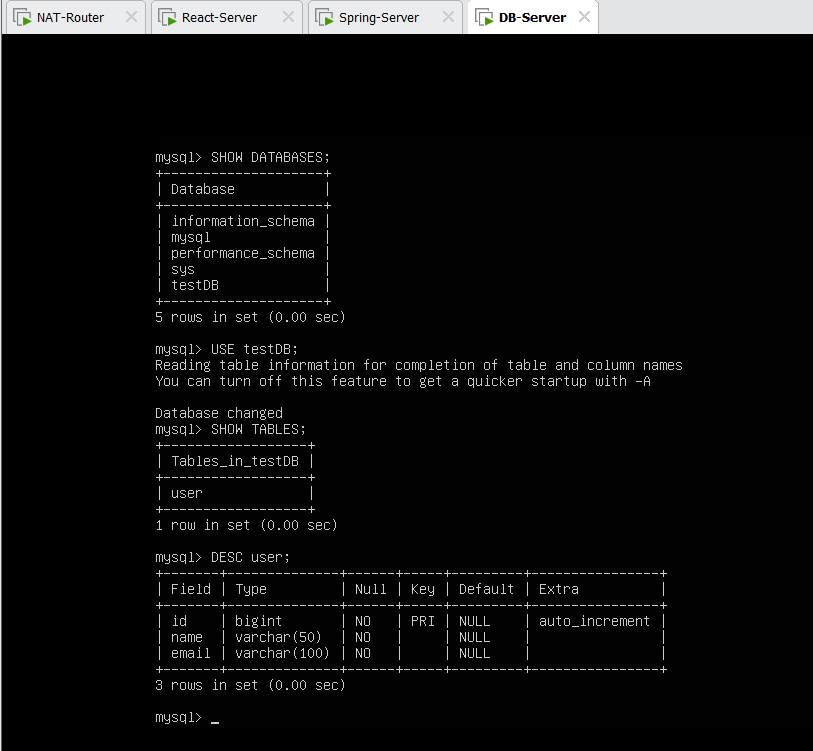
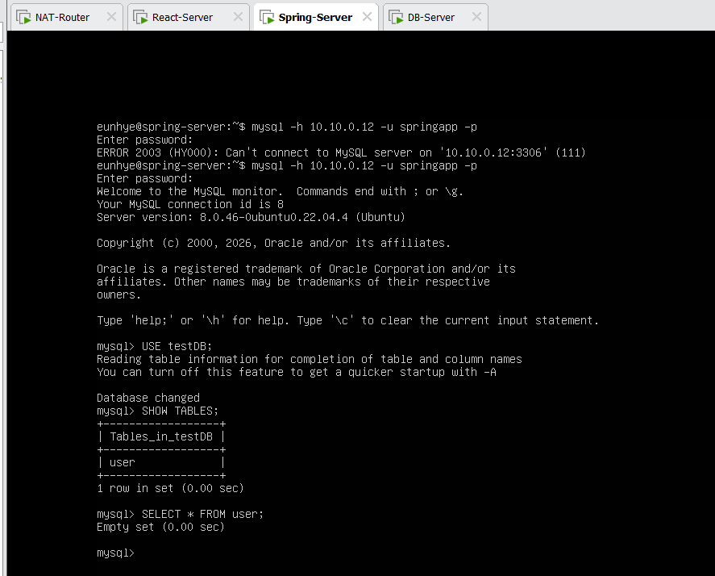
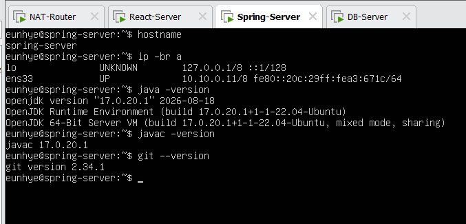
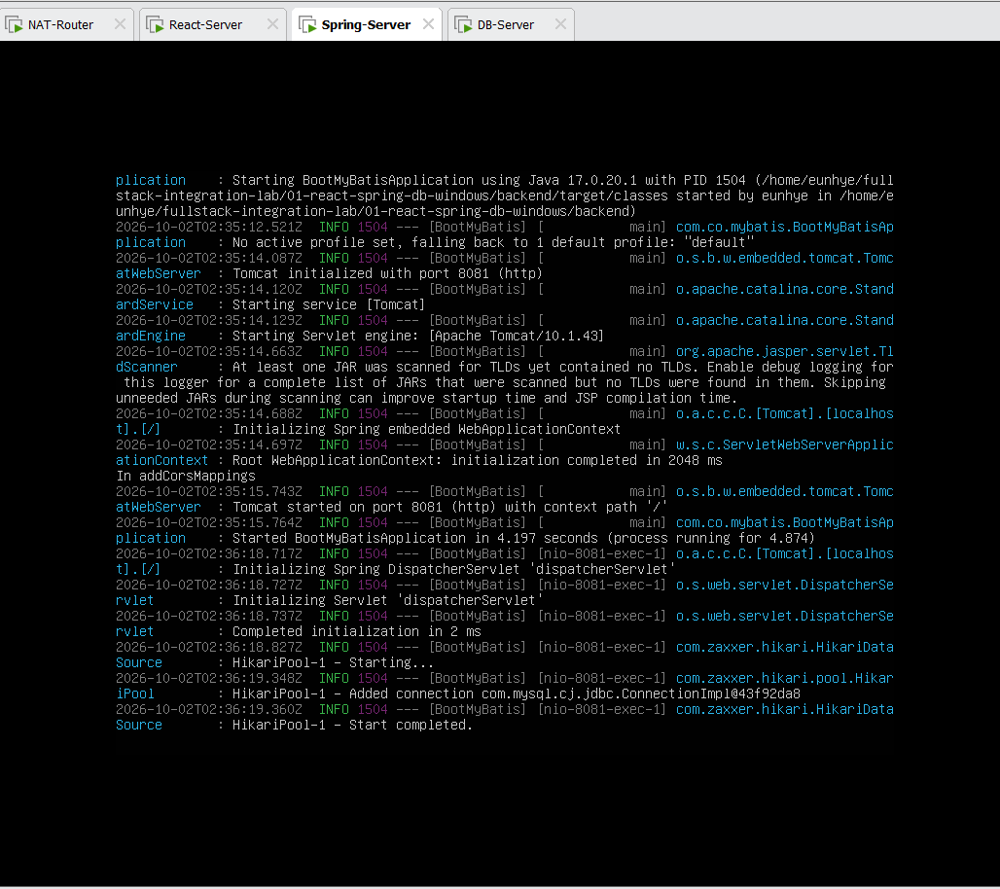
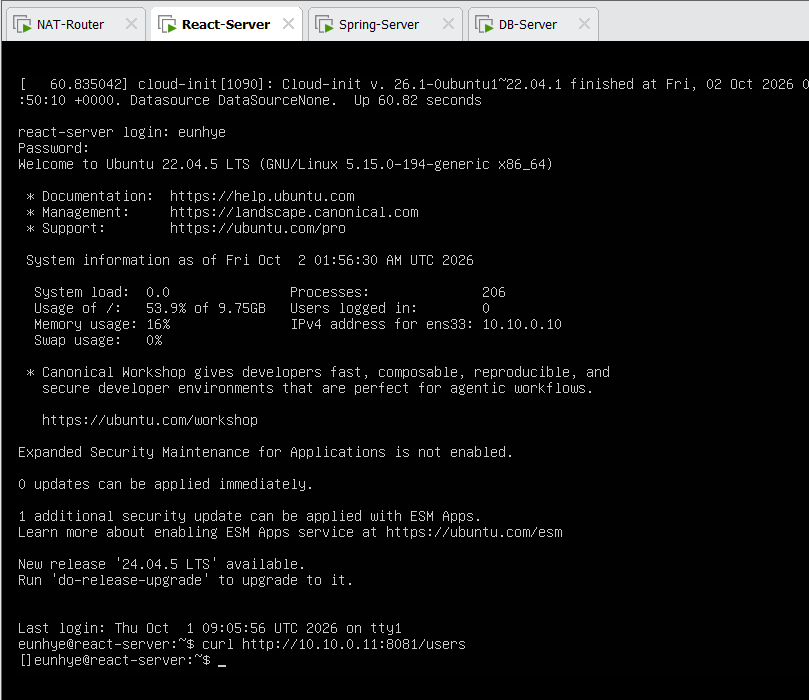
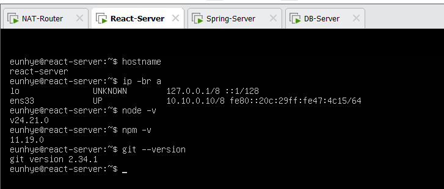
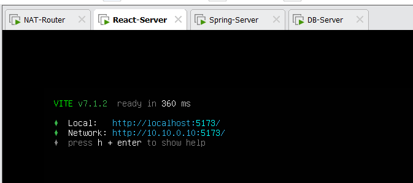
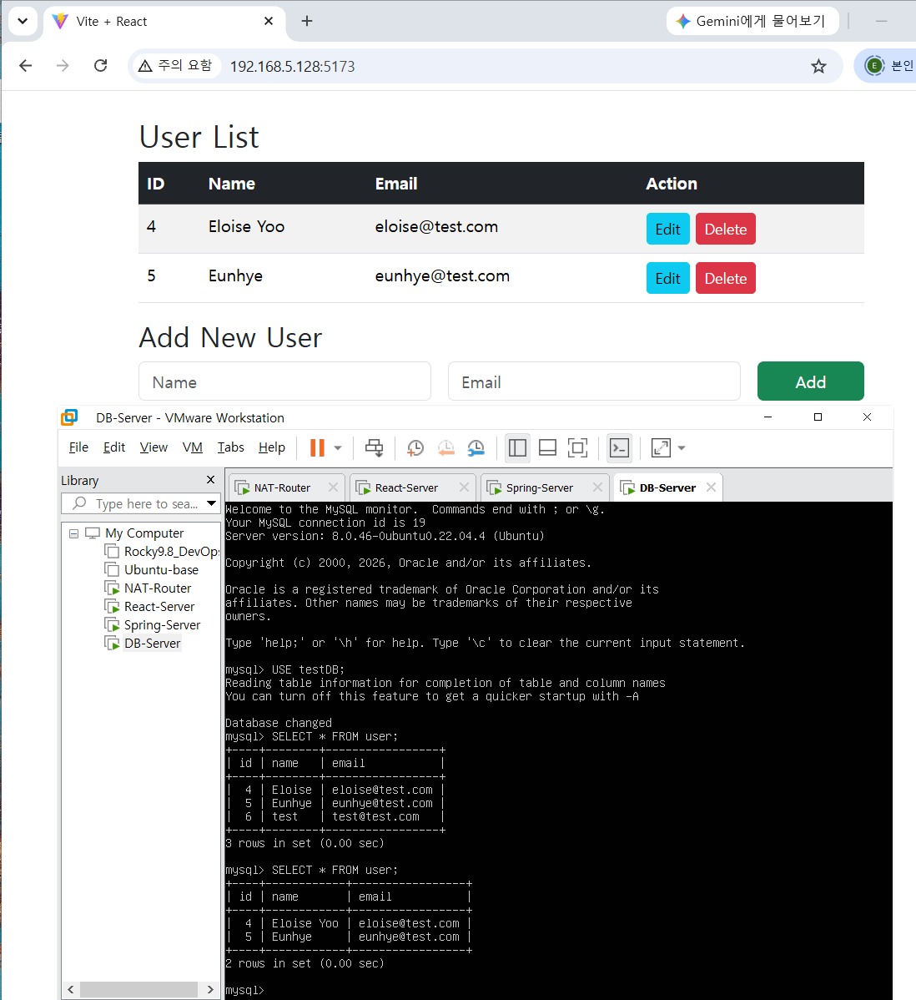

# Lab 02. Linux 3-Tier Integration with NAT Router

React · Spring Boot · MySQL을 각각 별도의 Ubuntu VM으로 분리하고,  
Linux NAT Router를 추가하여 **Network → Frontend → Backend → Database** 전체 통신 경로를 직접 구성한 실습.

1차 Windows 환경의 `localhost` 기반 연동을 실제 서버 분리 환경의 **IP 기반 통신 구조**로 확장.

---

## Overview

### Provided Mission

- Ubuntu 22.04 기반 React / Spring Boot / MySQL 서버 분리
- React: `10.10.0.10`
- Spring Boot: `10.10.0.11`
- MySQL: `10.10.0.12`
- Linux 환경에서 Frontend → Backend → Database 연동 검증
- `testDB.sql`을 SCP로 전달하여 DB 구성

### Extended / My Work

기본 3-VM 구성에 다음 항목 추가.

- 별도 **Linux NAT Router** 구축
- 내부 서버망과 외부망 분리
- Static IP / Default Gateway 설계
- IPv4 Forwarding + NAT MASQUERADE
- SSH / SCP 기반 원격 접근
- MySQL Remote Access 구성
- Windows Host → React Server DNAT Port Forwarding
- End-to-End CRUD 검증

---

## Architecture

```text
Windows Host
      │
      │ 192.168.5.0/24
      ▼
VMnet8 (VMware NAT)
      │
      ▼
Linux NAT Router
WAN : 192.168.5.x/24
LAN : 10.10.0.1/8
      │
      │ VMnet2 / 10.0.0.0/8
      │
 ┌────┴──────────┬─────────────┐
 ▼               ▼             ▼
React          Spring Boot     MySQL
10.10.0.10     10.10.0.11     10.10.0.12
:5173          :8081           :3306
```

| Server | Role | Address |
|---|---|---|
| NAT Router | Gateway / NAT | `10.10.0.1/8` + `192.168.5.x/24` |
| React | Frontend | `10.10.0.10:5173` |
| Spring Boot | Backend API | `10.10.0.11:8081` |
| MySQL | Database | `10.10.0.12:3306` |

---

## Key Implementation

### Deployment Context

Windows Lab의 애플리케이션을 역할별 Ubuntu VM으로 분리 배치. 고정 주소의 React / Spring Boot / MySQL 서버와 Linux NAT Router를 사용한 학습 환경이며, 운영용 배포 구성으로 검증한 것은 아님.

- 내부 서버 간 통신: 같은 `10.0.0.0/8`에서 직접 전달
- Windows 진입점: Router WAN `:5173` → DNAT → React/Vite
- 라우팅·NAT·SSH/SCP·Netplan 및 환경 설계 이유: [Notion 03 · Linux 3-Tier + NAT Router](https://app.notion.com/p/3ed1b198732a815091d2e0030512f175)

### Application Integration

#### Spring Boot → MySQL

MySQL은 별도 DB VM에서 실행하므로 `localhost` 대신 실제 DB Server IP 사용.

```text
Spring Boot
10.10.0.11
      ↓ TCP 3306
MySQL
10.10.0.12
```

Application 전용 DB 계정은 Spring Server에서만 접속하도록 제한.

```sql
'springapp'@'10.10.0.11'
```

DB 초기 구성과 SQL Import를 완료한 뒤 Application 전용 계정으로 연결.



DB Credential은 Source Code에 직접 저장하지 않고 환경변수로 주입.

```bash
export DB_URL='jdbc:mysql://10.10.0.12:3306/testDB'
export DB_USERNAME='springapp'
export DB_PASSWORD='<LOCAL_SECRET>'
```



---

#### Spring Boot Runtime

Java Runtime 환경 확인 후 Maven Wrapper로 Backend 실행, Tomcat `8081`과 MySQL Connection Pool 초기화 확인.





React Server에서 API 요청 직접 검증.

```bash
curl http://10.10.0.11:8081/users
```



---

#### React → Spring Boot

1차 Windows Lab에서는 두 Application이 같은 PC에 있어:

```javascript
target: 'http://localhost:8081'
```

을 사용했지만, 이번에는 별도 VM이므로 Spring Server의 실제 주소로 변경.

```javascript
server: {
  proxy: {
    '/users': {
      target: 'http://10.10.0.11:8081',
      changeOrigin: true
    }
  }
}
```

React Server의 `localhost`는 **React VM 자기 자신**을 의미하므로 Remote Backend 연결에는 사용 불가.

React Server의 Node.js Runtime과 Project 실행 환경 확인.



Vite는 외부 Interface에서도 요청을 받을 수 있도록 실행.

```bash
npm run dev -- --host 0.0.0.0
```



---

### End-to-End Flow

```text
Windows Browser
       ↓
NAT Router
       ↓ DNAT
React / Vite
10.10.0.10:5173
       ↓ Proxy
Spring Boot
10.10.0.11:8081
       ↓ JDBC / MyBatis
MySQL
10.10.0.12:3306
```

Browser에서 사용자 조회·생성·수정·삭제를 수행하고 MySQL Data와 비교하여 전체 CRUD 흐름 검증.



---

## Verification

| Application Check | Evidence |
|---|---|
| Node.js / Java 실행 환경 | 08-react-runtime · 09-spring-runtime |
| DB schema / 원격 연결 | 10-db-import · 12-spring-db-connectivity |
| Backend / HikariCP 실행 | 13-spring-boot-runtime |
| React VM → GET /users | 14-api-verification: JSON 배열 응답 |
| Vite 외부 인터페이스 Listen | 15-react-vite-runtime |
| Browser 결과와 DB 데이터 대조 | 17-linux-crud-verification |

기존 실습 기록에는 CRUD 수행이 남아 있고, 캡처에서 조회 화면과 DB row 변화 확인. 모든 CRUD method별 HTTP 요청·응답이 각각 캡처된 것은 아니므로 현재 증거 범위와 구분. 이번 검토는 코드·기존 캡처 대조이며 VM 재실행은 수행하지 않음.

라우팅·Gateway·NAT counter·SSH/SCP 검증은 같은 미션의 Notion 03에 상세 기록.

---

## Troubleshooting

### `localhost`와 Remote DB의 의미

Spring Server에서 `sudo mysql` 실행 시 Remote DB가 아니라 Spring VM 자신의 Local MySQL 탐색.

Remote Server 접근 시 대상 Host 명시 필요. 캡처 12에는 첫 접속 실패 뒤 원격 로그인 성공이 함께 남아 있으나, 그 사이 조치의 정확한 명령·시간은 별도 **NOT VERIFIED**.

```bash
mysql -h 10.10.0.12 -u springapp -p
```

분리 서버 환경에서 **`localhost = 현재 명령을 실행하는 서버 자신`**이라는 점을 실제 연결 오류로 확인.

---

## Runtime / Reproduction

현재 폴더는 배포 기록과 이미지이며 별도의 frontend/backend 소스를 포함하지 않음. [Lab 01 소스](../01-react-spring-db-windows/)를 각 VM에서 재사용하고, 실행 환경에서 DB 주소와 Vite proxy를 변경한 실습.

1. Notion 03의 VM·Network·DB 설정 준비
2. Spring VM에서 Lab 01 backend로 이동하고 DB 환경변수 주입 후 `./mvnw spring-boot:run`
3. React VM에서 Lab 01 frontend의 Vite proxy를 `10.10.0.11:8081`로 변경 후 `npm install`, `npm run dev -- --host 0.0.0.0`
4. Router WAN `:5173`으로 접속하여 API와 DB 결과 대조

저장소의 Lab 01 `vite.config.js`는 Windows용 `localhost:8081` 설정 유지. Linux용 proxy 예제는 VM에서 적용한 환경별 변경이며 저장소에 별도 Linux 소스 사본이 있는 것은 아님. 강사 제공 원본 `testDB.sql`은 [Notion 03 · Database Import](https://app.notion.com/p/3ed1b198732a815091d2e0030512f175)의 `testDB.zip`에 첨부. 압축 해제 후 사용하며 저장소에는 SQL 사본을 두지 않음. 깨끗한 DB에서 전체 재실행은 **NOT VERIFIED**.

## What I Learned

분리 서버에서 `localhost`는 현재 프로세스가 실행되는 VM 자신. 브라우저 요청 주소, Vite proxy 대상, JDBC host를 각각 해당 실행 위치에 맞게 구분.

정상 화면뿐 아니라 Backend JSON 응답, HikariCP 초기화, DB 조회 결과를 함께 대조하여 애플리케이션 계층별 연결 확인.

---

## Related Infrastructure Lab

전체 구축 과정, 사용 명령어, Netplan 설정, SSH/SCP, MySQL Remote Access, NAT 구성 및 각 명령의 의미는 별도 Infrastructure Lab에 상세 기록.

[Notion 03 · Linux 3-Tier + NAT Router](https://app.notion.com/p/3ed1b198732a815091d2e0030512f175)