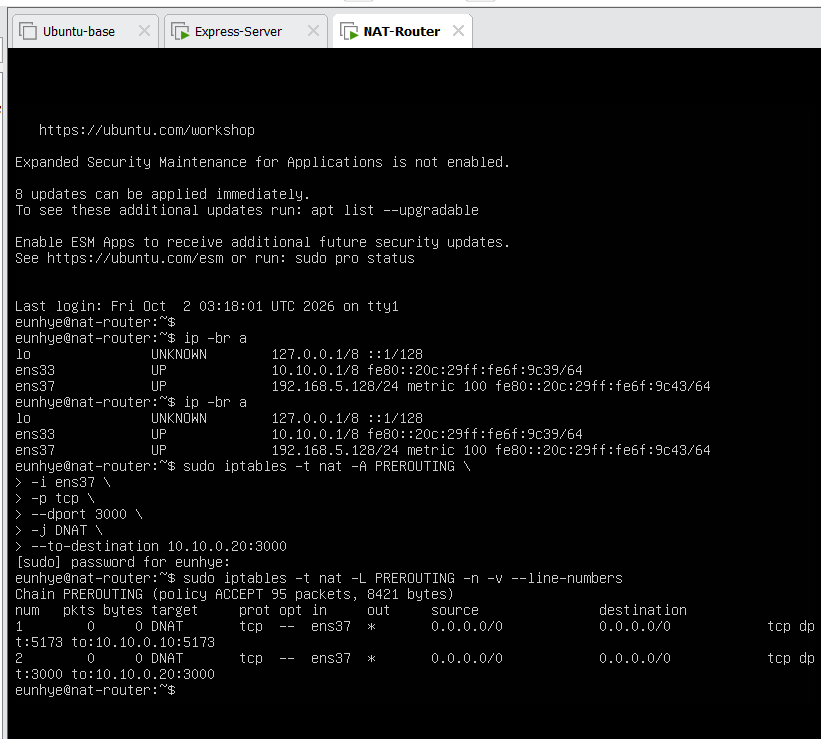
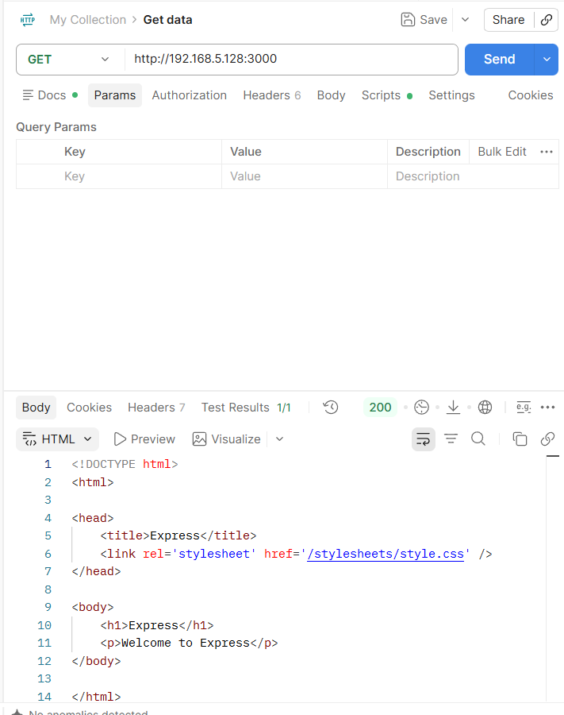

# Lab 03. Express REST API & Middleware

Ubuntu 22.04 환경에서 Express.js 서버를 구성하고, Postman으로 **Routing · Middleware · HTTP Method · Request Data · Response** 흐름을 검증한 실습.

기본 API 구현에 기존 Linux NAT Router 구조를 연결하여 **Windows Client → NAT Router → Express Server** 접근 경로까지 함께 확인.

---

## Overview

### Provided Mission

- Ubuntu 22.04 Express Server 구성
- Express Generator + EJS 기반 기본 프로젝트 생성
- GET / POST Routing
- Query Parameter 처리
- Path Parameter 처리
- JSON Request Body 처리
- Update / Delete API 응답 구현
- Postman 기반 API 검증
- DB 미연동 상태에서 Request / Response 흐름 확인

### Extended / My Work

- Express Server를 기존 VMnet2 내부망에 배치
- NAT Router `:3000` → Express Server `:3000` DNAT 구성
- Windows Postman에서 내부 Express API 접근 검증
- NAT Router를 Jump Host로 사용한 VS Code Remote SSH 개발 환경 구성
- `app.js`의 Middleware 실행 순서와 Router 연결 구조 분석

---

## Architecture

```text
Windows 11
Postman / VS Code
      │
      │ HTTP :3000 / SSH
      ▼
NAT Router
WAN 192.168.5.128
LAN 10.10.0.1
      │
      │ DNAT / VMnet2
      ▼
Express Server
10.10.0.20:3000
      │
      ├─ app.js
      │   ├─ Middleware
      │   └─ /test → testRouter
      │
      └─ routes/test.js
```

| Component | Role | Address |
|---|---|---|
| Windows 11 | Postman / VS Code Client | VMnet8 Host |
| NAT Router | Gateway / DNAT / SSH Jump Host | `192.168.5.128` / `10.10.0.1` |
| Express Server | REST API Server | `10.10.0.20:3000` |

---

## Key Implementation

### Express Runtime

Node.js Runtime과 npm 기반 Express Project 구성.

```bash
express --view=ejs express-middleware-lab
cd express-middleware-lab
npm install
npm start
```

```text
Node.js → JavaScript Runtime
npm     → Package / Dependency Management
Express → Node.js Web Server / API Framework
```


---

### Middleware & Router Flow

`app.js`에서 공통 Middleware를 등록한 뒤 URL Prefix에 따라 Router 연결.

```javascript
app.use(logger('dev'));
app.use(express.json());
app.use(express.urlencoded({ extended: false }));
app.use(cookieParser());
app.use(express.static(path.join(__dirname, 'public')));

app.use('/test', testRouter);
```

`app.use(express.json())`은 경로 제한 없이 요청 흐름에 등록되며, JSON Body가 존재할 경우 Parsing 후 `req.body`로 제공.

```text
Request
→ Middleware
→ Router
→ Handler
→ Response
```

---

### Request Data Handling

| Input Location | Express | Example |
|---|---|---|
| Query String | `req.query` | `/plus?num1=10&num2=20` |
| URL Path | `req.params` | `/minus/10/20` |
| Request Body | `req.body` | JSON `{"name":"홍길동"}` |

Request의 값 전달 위치와 Response 형식은 별도 개념으로 처리.

```text
Request Input
query / params / body
        ↓
Application Logic
        ↓
Response
Text / JSON / HTML
```

---

### DNAT / API Access

Windows Host에는 VMnet2 직접 경로를 두지 않았으므로 NAT Router WAN의 `:3000` 요청을 내부 Express Server로 전달.

```bash
sudo iptables -t nat -A PREROUTING \
  -i ens37 \
  -p tcp \
  --dport 3000 \
  -j DNAT \
  --to-destination 10.10.0.20:3000
```

```text
Windows Postman
→ Router WAN 192.168.5.128:3000
→ DNAT
→ Express 10.10.0.20:3000
```



Postman에서 Router WAN 주소로 기본 Express Endpoint 호출 후 HTTP 200 응답 확인.



---

### Remote Development

VMware Console에서 직접 편집하는 대신 NAT Router를 Jump Host로 사용하여 Windows VS Code에서 Express Server의 Project를 직접 편집.

```text
Windows VS Code
→ SSH Jump Host
  192.168.5.128
→ Express Server
  10.10.0.20
```

Remote VS Code에서 수정한 파일은 Windows 복사본이 아니라 Linux Server의 실제 Project File에 저장.

---

## API Verification

### GET / POST

동일한 `/test` Path라도 HTTP Method에 따라 별도 Handler로 처리.

```javascript
router.get('/', function(req, res) {
  res.send('GET 요청 테스트 성공');
});

router.post('/', function(req, res) {
  res.json({
    message: 'POST 요청 테스트 성공'
  });
});
```


### Query Parameter

```text
GET /test/plus?num1=10&num2=20
→ req.query
→ Number conversion
→ 30
```


### Path Parameter

```text
GET /test/minus/10/20
→ req.params
→ 큰 수 - 작은 수
→ 10
```


### Request Body

```text
POST /test/profile
+ JSON Body
→ express.json()
→ req.body
→ JSON Response
```


### Params + Body

```text
PUT /test/update/1
+ {"name":"김철수"}

→ req.params.id
→ req.body.name
→ JSON Response
```


### DELETE

DB 미연동 상태에서 실제 Row 삭제 대신 DELETE Request → Path Parameter 추출 → JSON Response 흐름 검증.


---

## Verification Summary

| Method | Endpoint | Input | Express Access | Result |
|---|---|---|---|---|
| GET | `/test` | - | - | PASS |
| POST | `/test` | - | - | PASS |
| GET | `/test/plus` | Query | `req.query` | PASS |
| GET | `/test/minus/:num1/:num2` | Path | `req.params` | PASS |
| POST | `/test/profile` | JSON Body | `req.body` | PASS |
| PUT | `/test/update/:id` | Path + JSON Body | `req.params + req.body` | PASS |
| DELETE | `/test/delete/:id` | Path | `req.params` | PASS |

---

## Troubleshooting

### Host → Internal Express Server 직접 접근 경로 부재

**Symptom**

Windows Postman에서 내부 VM의 `10.10.0.20:3000`을 직접 Target으로 사용할 수 없는 구조.

**Cause**

Express Server는 VMnet2 내부망에만 연결되어 있고 Windows Host에는 VMnet2 Host Adapter를 두지 않아 Host → `10.10.0.20` 직접 Route가 존재하지 않음.

**Fix**

NAT Router의 WAN Interface로 들어오는 TCP `:3000` 요청을 `10.10.0.20:3000`으로 DNAT.

```text
Windows
→ 192.168.5.128:3000
→ PREROUTING DNAT
→ 10.10.0.20:3000
```

**Verification**

DNAT Rule의 Packet Counter와 Postman HTTP 200 Response를 통해 외부 측 Client → Router → 내부 Express Server 경로 확인.

---

## What I Learned

- `app.js` = Express Application의 Middleware 순서와 Router 연결을 정의하는 중심 설정
- Middleware = Request와 최종 Handler 사이의 공통 처리 단계
- Router = URL Path와 HTTP Method에 따른 Handler 분리
- 동일 URL도 GET / POST 등 HTTP Method에 따라 다른 API로 처리 가능
- `req.query`, `req.params`, `req.body`의 역할 차이
- `res.send()`, `res.json()`, `res.render()`의 Response 형식 차이
- Node.js Runtime · npm Dependency · Express Application의 관계
- API 구현과 실제 Network 접근 경로를 함께 검증하는 방식 이해

---

## Detailed Lab Notes

Express Generator 구조, `app.js` Middleware 흐름, Postman 사용법, Query / Params / Body 차이와 각 API 구현 과정은 Notion에 상세 기록.

[View detailed Infrastructure Lab notes](https://app.notion.com/p/3ed1b198732a8195bf58df22d368f5c9?pvs=204)
