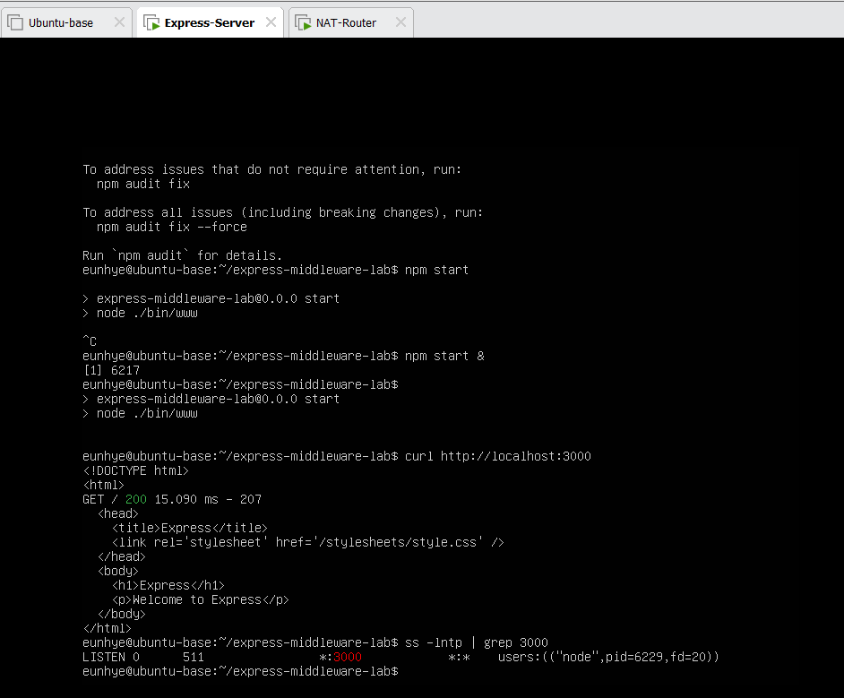
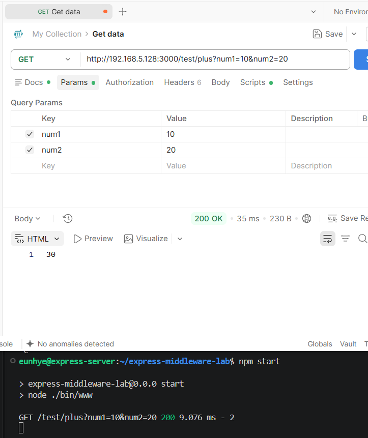
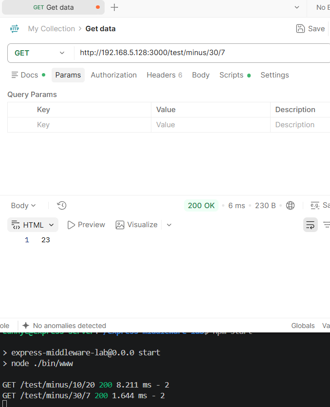
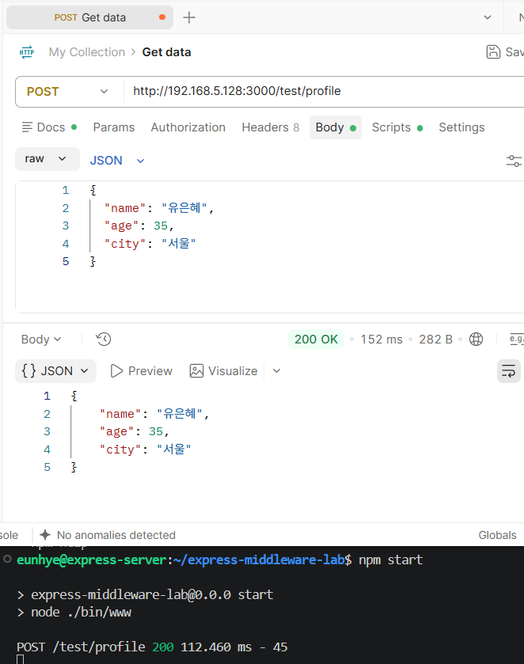
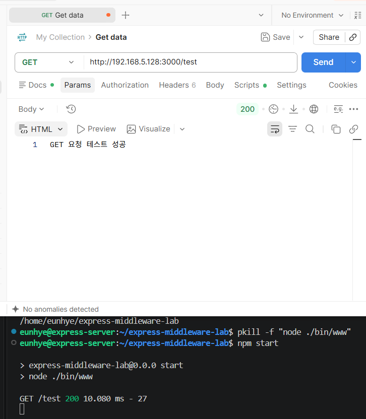
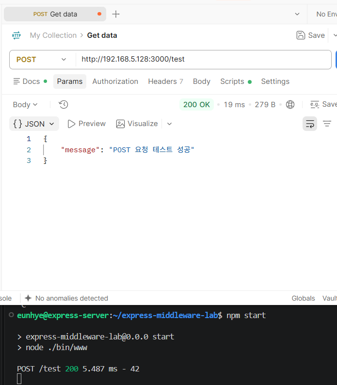
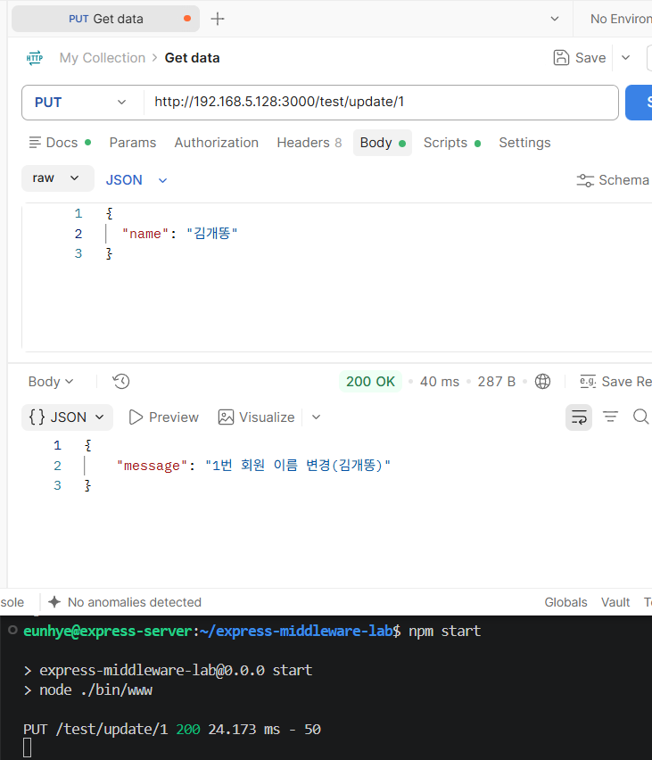
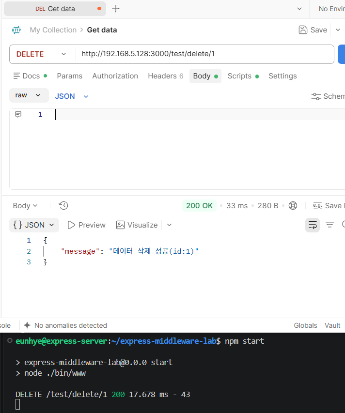

# Lab 03. Express REST API & Middleware

Express.js에서 **HTTP Method · Routing · Middleware · Query / Path Parameter · Request Body · Response**가 어떻게 연결되는지 직접 구현하고 Postman으로 검증한 API 실습.

> 같은 미션의 Network / DNAT / SSH 구성 과정은 [Notion 04 · Express REST API & Middleware](https://app.notion.com/p/3ed1b198732a8195bf58df22d368f5c9?pvs=204)에 별도 기록.

---

## Overview

이번 Lab의 개발 측 핵심은 요청 형식에 따라 값을 어디서 꺼내고 어떤 형식으로 응답할지 구분하는 것.

```text
Request
├─ Method
├─ Path
├─ Query
└─ Body
     ↓
Middleware
     ↓
Router / Handler
     ↓
Response
├─ Text
├─ JSON
└─ HTML
```

---

## Project Structure

```text
03-express-rest-api-middleware/
├─ .gitignore
├─ README.md
├─ app.js
├─ bin/
│  └─ www
├─ routes/
│  ├─ index.js
│  ├─ users.js
│  └─ test.js
├─ views/
├─ public/
├─ docs/images/
├─ package.json
└─ package-lock.json
```

- `app.js` — Middleware 등록 및 Router 연결
- `bin/www` — HTTP Server 실행 / Port Listen
- `routes/test.js` — 이번 Lab의 API Handler
- `views/` — EJS Template
- `package.json` — Dependency / npm Script

---

## Runtime

저장소에 업로드된 소스를 실행하는 절차. 새 generator 프로젝트를 생성하지 않고 현재 폴더의 `package.json`과 `bin/www` 사용.

```bash
git clone https://github.com/Eunhye-yoo/fullstack-integration-lab.git
cd fullstack-integration-lab/03-express-rest-api-middleware
npm install
npm start
```

기본 주소는 `http://localhost:3000`. `bin/www`에서 `PORT` 환경변수로 포트 변경 가능. `node_modules/`는 Git 추적 대상에서 제외.

- `package.json`: Express `~4.16.1`, EJS `~2.6.1`
- `package-lock.json`: Express `4.16.4`, EJS `2.6.2`
- Express VM의 Node.js/npm 버전: 미기록.



---

## Middleware & Router

`app.js`

```javascript
app.use(logger('dev'));
app.use(express.json());
app.use(express.urlencoded({ extended: false }));
app.use(cookieParser());
app.use(express.static(path.join(__dirname, 'public')));

app.use('/', indexRouter);
app.use('/users', usersRouter);
app.use('/test', testRouter);
```

`express.json()`은 `Content-Type: application/json`에 맞는 Request Body를 Parsing하여 `req.body`로 제공. `express.urlencoded({ extended: false })`는 URL-encoded form body 처리. `app.use()` 등록 순서에 따라 parser가 `/test` Router보다 먼저 실행.

최종 Endpoint는 Router Mount Path와 개별 Route Path의 결합으로 결정.

```text
app.use('/test', testRouter)
+
router.get('/plus', ...)
=
GET /test/plus
```

---

## Request Data Handling

| Request Data | Express Access | Example |
|---|---|---|
| Query String | `req.query` | `?num1=10&num2=20` |
| Path Parameter | `req.params` | `/minus/10/20` |
| JSON Body | `req.body` | `{"name":"홍길동"}` |

### Query Parameter

```javascript
router.get('/plus', function(req, res) {
  var num1 = Number(req.query.num1);
  var num2 = Number(req.query.num2);

  var result = num1 + num2;

  res.send(String(result));
});
```



### Path Parameter

```javascript
router.get('/minus/:num1/:num2', function(req, res) {
  var num1 = Number(req.params.num1);
  var num2 = Number(req.params.num2);

  var result = Math.abs(num1 - num2);

  res.send(String(result));
});
```

`minus`는 일반 뺄셈이 아니라 두 수의 **절대 차이** 반환. 캡처의 `/test/minus/30/7` 결과는 `23`.



### Request Body

```javascript
router.post('/profile', function(req, res) {
  var name = req.body.name;
  var age = req.body.age;
  var city = req.body.city;

  res.json({
    name: name,
    age: age,
    city: city
  });
});
```



---

## HTTP Methods & Response

### GET / POST

동일한 `/test` Path라도 HTTP Method가 다르면 다른 Handler로 처리.





### PUT — Params + Body

```text
PUT /test/update/1
+ {"name":"김철수"}

req.params.id
+
req.body.name
↓
JSON Response
```



### DELETE — Path Parameter

PUT과 DELETE 모두 DB 미연동 상태. UPDATE/DELETE 메시지를 만드는 요청·응답 흐름이며, 실제 데이터 수정·삭제나 저장을 구현한 것은 아님.



---

## Verification

Postman에서 GET/POST, 덧셈 `10 + 20 → 30`, 절대 차이 `30 / 7 → 23`, profile body 반환, PUT/DELETE 응답과 HTTP 200 확인.

### API Summary

| Method | Endpoint | Input | Response |
|---|---|---|---|
| GET | `/test` | - | Text |
| POST | `/test` | - | JSON |
| GET | `/test/plus` | Query | Text |
| GET | `/test/minus/:num1/:num2` | Path Params | Text |
| POST | `/test/profile` | JSON Body | JSON |
| PUT | `/test/update/:id` | Path + Body | JSON |
| DELETE | `/test/delete/:id` | Path Params | JSON |

---

### Current Scope

HTTP method와 입력 위치를 구분한 학습용 API. 숫자 입력 검증, 인증, DB 영속화, 운영 배포는 검증 범위에 포함하지 않음. `/test/update/:id`, `/test/delete/:id`는 실습 경로이며 일반적인 리소스 중심 REST 경로 설계와 구분.

## What I Learned

- HTTP Method와 URL Path를 조합해 API Handler 분리
- `req.query`, `req.params`, `req.body`의 역할 구분
- `express.json()` Middleware가 JSON Body를 Parsing하는 위치 이해
- Request의 입력 위치와 Response 형식은 서로 독립적인 개념
- `res.send()`, `res.json()`, `res.render()`의 차이
- `app.js`를 단순 실행 파일이 아니라 **Middleware와 Router의 전체 요청 흐름을 조립하는 파일**로 이해

---

## Related Infrastructure Lab

Ubuntu VM, DNAT, 내부망 접근 경로, SSH Jump Host 구성 및 Network Troubleshooting은 Notion에 분리 기록.

[Notion 04 · Express REST API & Middleware](https://app.notion.com/p/3ed1b198732a8195bf58df22d368f5c9?pvs=204)
